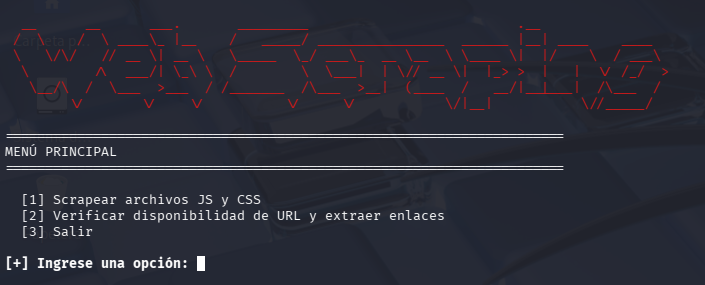

## Web Scraping

<p align="center">
  
</p>

Web scraping es una técnica de extracción de datos utilizada para recopilar información de páginas web de forma automatizada.

El proceso generalmente implica:
- Automatización de solicitudes HTTP.
- Extracción de datos relevantes de la respuesta del servidor.
- Almacenamiento de los datos en un formato estructurado (CSV, JSON, etc.).

---

## ⚙️ Requisitos

- Python 3.8 o superior
- Librerías: requests, BeautifulSoup4, os

---

## 🚀 Instalación

Clona el repositorio y accede al directorio:

```bash
git clone https://github.com/Devsebastian44/Web-Scraping.git
cd Web-Scraping
```

---

## ▶️ Uso

Ejecuta el script principal:

```bash
python3 scraping.py
```

<p align="center">
  
</p>

---

## 📜 Licencia

Este proyecto está bajo la licencia MIT. Puedes usarlo libremente, siempre citando al autor.


