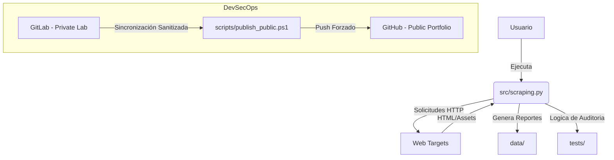

# Arquitectura del Sistema

Este diagrama describe el flujo de datos y la interacción entre componentes del Web-Scraper y el flujo DevSecOps.

```mermaid
graph TD
    A[Usuario] -->|Ejecuta| B(src/scraping.py)
    B -->|Solicitudes HTTP| C[Web Targets]
    C -->|HTML/Assets| B
    B -->|Genera Reportes| D[data/]
    B -->|Logica de Auditoria| E[tests/]
    
    subgraph DevSecOps
        F[GitLab - Private Lab] -->|Sincronización Sanitizada| G[scripts/publish_public.ps1]
        G -->|Push Forzado| H[GitHub - Public Portfolio]
    end
```
